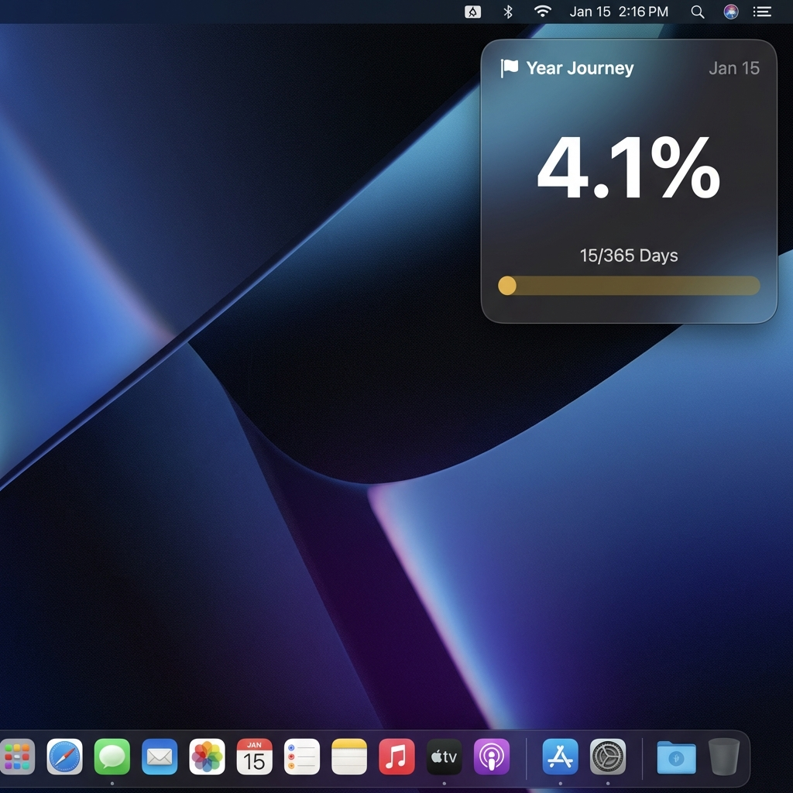

# Liquid Glass Clock Widget

A minimal "Year Progress" widget for [Übersicht](http://tracesof.net/uebersicht/) with a liquid glass aesthetic.

## Features
- **Liquid Glass Design**: Blur, saturation, and translucent gradients.
- **Year Progress**: Tracks the percentage of the year passed (to 1 decimal place).
- **Date & Day Count**: Clearly displays the current date and day number.

## Installation

1. Download `LiquidGlassClock.widget.zip` from the releases (or clone this repo).
2. Unzip and move `LiquidGlassClock.widget` to your Übersicht widgets folder.
   - Typically: `~/Library/Application Support/Übersicht/widgets/`

## Configuration
Open `index.jsx` to tweak:
- Colors
- Font sizes
- Layout preferences
